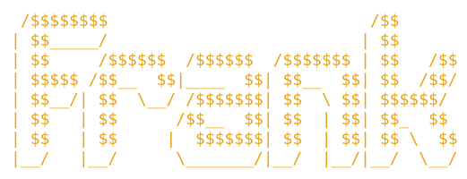

<div align="center">



**He's a duck. He's frank. He will not tell you your plan is great.**

*A duck you can talk to when your AI agent hands you a plan and your brain
quietly leaves the building.*

</div>

---

## The situation

Your agent just wrote you a 47-step plan. You read step 1. You skimmed step
2. You clicked **Approve**, because you always click Approve.

Step 31 adds Redis. You don't have Redis. You're going to find that out
around 6pm on a Friday.

You're not alone. People approve
[93% of Claude Code's permission prompts](https://www.anthropic.com/engineering/claude-code-auto-mode).
That isn't reviewing. That's a reflex with a keyboard.

**Frank is the duck that makes you actually look.** Press a hotkey and he
shows up with your plan already open. He finds the handful of calls that
matter, checks them against your real code, talks them through with you, and
hands your agent a note with your decisions. Then he leaves. No small talk.

```
   your agent           Frank                you              your agent
   writes a      --->   finds the     --->   make the  --->   gets a note:
   47-step plan         5 calls that         calls            "keep this,
                        actually matter      (with a duck)     change that"
```

Open source. Runs on your machine. Uses the AI subscription you already pay
for, because you don't need another one.

---

## How it works

1. **Summon him.** Press `⌥⇧Space` (or your own hotkey), or click Frank in
   your menu bar. He talks. Switch him to chat if you're in an open-plan
   office and have some dignity left.
2. **He finds the plan.** Frank grabs the plan your agent just wrote, plus
   your repo and the files the plan touches. You don't paste anything.
3. **He tells you the read.** Out loud, in about thirty seconds: what the
   plan does and why, and each call that needs you, in a line. Then: "Which
   one do you want to talk through?" On screen, what he checked and found
   fine, so you can stop worrying about it. The calls, five at
   most, hardest to undo first:
   - **options the plan offers:** "Redis or in memory?"
   - **choices it made without asking:** new dependencies, schema changes,
     "let's apply this to every route"
   - **assumptions that don't hold:** "there is no Redis in this repo,
     buddy"
4. **One call at a time.** Each call is a plain question ("where should
   the counters live?"), the plan's own words, what you gain and what you
   pay for each option, and the one fact it comes down to ("will you run
   more than one instance?"). Answer that and Frank points at the option it
   leads to. Ask *"what would you do?"* and you get a straight answer. He
   doesn't hedge. He's a duck.
   Just say it: "the Redis one", "no, just one", "yes", "next". He hears
   when you've finished, answers, and listens again. Speech is turned into
   text on your Mac; audio never leaves it.
5. **Back to work.** Frank writes a short note for your agent (keep this,
   change that, drop this), copies it, and goes back to wherever ducks go.

Also good for: comparing two plans, sanity-checking an idea before you ask
your agent, and the bug you've been staring at for an hour while telling
yourself you're "close."

---

## A typical Frank session

```
You  ⌥⇧Space  "not sure about this plan"

 __
(o )>  Claude Code's plan from 3 min ago: "Add rate limiting to the API"
       Three calls worth a look:
       1. Store counts in Redis        (the plan decided this for you)
       2. Apply to every route         (including /health, apparently)
       3. Add express-rate-limit       (new dependency)
       Start with 1?

You  "yeah"

 __
(o_)>  Redis vs in memory:
                     Redis                    In memory
       Undo later    painful (new service)    easy
       Effort        Redis + config + ops     about one file
       Works for     many instances           one instance

       Also, I looked. There is no Redis in your repo or your
       docker-compose. Are you running more than one instance?

You  "no, just one"

 __
(^ )>  Then in memory. The plan is solving a scaling problem you
       don't have. Next: it wants to rate-limit /health, which means
       your load balancer gets throttled and declares you dead...

       ...

       Note for your agent (copied):
       "Go ahead with these changes: in-memory counters instead of
        Redis; only /api/public, not /health; keep express-rate-limit."

       Go ship. Quack.
```

---

## Frank's moods

He shows these in your menu bar, so you always know where you stand.

```
  idle        listening      thinking       judging        done
   __           __             __             __             __
  (o )>        (O )> ))       (- )> ...      (o_)> ?!       (^ )> go
```

`judging` is not a bug. `judging` is the product.

---

## Sticky mode (off by default, because it's weird)

By default Frank lives in your menu bar and only appears when you call him.
Turn on **sticky mode** and he sits in the corner of your screen, always on
top, watching you work. Silently.

```
 .------------------------------------------------------.
 | $ npm run dev                                        |
 | > server running on :3000                            |
 | > everything is fine                                 |
 |                                                      |
 |                                              __      |
 |                                             (o_)>    |
 |                                           sure, Jan  |
 '------------------------------------------------------'
```

You can drag him anywhere. He'll remember. Ducks remember everything.

---

## Frank doesn't want your credit card

You already pay for an AI. Frank borrows its brain, politely and through
the front door.

| You already have | How Frank uses it |
| --- | --- |
| **Claude Code** (Pro, Max or API) | Runs your installed Claude Code in the background. You stay signed in through Claude Code itself, and Frank never sees your login. He's a duck, not a pickpocket. |
| **GitHub Copilot** (any plan, including Free) | Uses GitHub's official Copilot SDK. It counts toward your Copilot allowance. |
| **Cursor** | Runs the Cursor CLI in the background, on your Cursor subscription. |
| **An API key** | Anthropic, OpenAI or any OpenAI-compatible endpoint. |
| **Absolutely nothing** | A local model through Ollama. Free, and nothing leaves your machine. |

On first run, Frank checks what you have and asks which one to use.
Whatever you pick, Frank only reads. He never edits your code and never runs
commands through your agent. Wings, not hands.

---

## Where your agents hide their plans (Frank knows)

| Agent | Where Frank looks |
| --- | --- |
| Claude Code | Plan files in `~/.claude/plans/` (or your `plansDirectory`), plus recent session history |
| Cursor | Plan files in `~/.cursor/plans/*.plan.md` and any plans saved to your workspace |
| Codex CLI | Recent sessions in `~/.codex/sessions/` |
| Anything else | Your clipboard, a selected file, or text you drop on Frank |

Frank only looks when you call him. He opens the most recent plan for the
project you're in, and you can switch to another in one click. Want another
agent supported? It's a small adapter. Send a PR. Frank will judge it
fairly.

---

## Frank's rules

Frank **will**:

- keep it short: a few calls, one question at a time
- show you receipts from your actual code
- tell you when the plan is wrong, *and* when you are
- give you a straight answer when you ask for one

Frank **will never**:

- pop up uninvited (he's a duck, not a paperclip)
- say *"You're absolutely right!"* unless you are
- edit your code, run your commands, or open your `.env`
- phone home, track you, or sell anything to anyone

---

## "Isn't this just Copilot's Rubber Duck?"

No. They sound alike, but they're different animals. One of them is barely
an animal.

[GitHub Copilot's Rubber Duck](https://docs.github.com/en/copilot/concepts/agents/copilot-cli/rubber-duck)
is a robot that reviews your robot. **Frank is a duck that helps you, the
human, make the calls.**

| | Copilot's Rubber Duck | Frank |
| --- | --- | --- |
| **Helps** | The agent: a second model reviews the agent's work | You: a duck you talk to when you're overwhelmed |
| **Runs** | Automatically, at checkpoints in a Copilot session | When you call him, from anywhere |
| **Gives you** | A list of concerns the agent uses to fix its work | The plan's key decisions, talked through one by one, plus a note for your agent |
| **Scope** | One Copilot session | The plan in front of you, from any agent |
| **Beyond plans** | Reviewing the agent's work | Any stuck moment, including that bug |
| **Runs on** | Copilot | Your Claude Code, Copilot or Cursor subscription, an API key, or a local model |

They get along fine. Rubber Duck makes the agent's plan better. Frank makes
sure the calls in it are the ones you'd actually make. Professionally
cordial.

---

## Privacy

What happens on your machine stays on your machine.

Frank reads your plans and code only when you call him, shows you what he
found before using it, and sends it only to the model you picked. There's no
account, no server and no telemetry. Frank doesn't have a cloud. He has a
pond, and it's on your laptop.

Run a local model and nothing leaves your machine at all.

Voice is on-device too: Frank hears you with Whisper and Silero, and talks
with Kokoro, all running on your Mac. Audio is never saved or sent. Only the
words go to the brain, same as typing them. Before Frank talks, an on-device
code-aware pronunciation layer handles acronyms, identifiers, versions,
ports, paths and symbols. Each voice has a faster tuned pace, with a speed
control in the voice picker.

---

## FAQ

**Why a duck?**
Rubber duck debugging: explain your problem to a duck, and the answer shows
up halfway through your sentence. Frank is that duck, except he talks back.
Sometimes you won't like what he says. That's the point.

**Why "Frank"?**
Because he's frank. The other names sounded like law firms.

**Will Frank tell me my plan is great?**
If it is. It usually isn't. Nobody's is. That's why you're here.

**Does Frank write code?**
No. He has wings, not hands. Your agent writes the code. Frank makes sure
it's writing the right code.

**Can I make Frank nicer?**
No.

**Will he pop up in the middle of my work?**
Never. He only shows up when you call him. (Unless sticky mode is on, in
which case he's just... there. Watching. You asked for this.)

---

## Status

```
     .--.
    /  , \      Frank has hatched. He's wobbly. M1 is under way.
   |  /   |
    \/   /
     '--'
```

What works today: the menu bar duck, the hotkey (tap to open, hold to
talk), finding your latest Claude Code plan, reading the files it mentions,
the read, Frank briefing you out loud and talking each call through with you
(voice first, hands-free, or chat if you'd rather), and copying the note. Brains: Claude Code, GitHub Copilot, the
Anthropic and OpenAI APIs (or anything OpenAI-compatible), and Ollama.

### Try it (macOS, early, unsigned)

1. Open the latest green [CI run](https://github.com/fatmali/frank/actions/workflows/ci.yml?query=branch%3Amain)
   and download **Frank-macos**.
2. Unzip it and move `Frank.app` to Applications.
3. Frank isn't signed yet, so macOS will call him damaged. He isn't. He's
   just unsigned:

   ```sh
   xattr -dr com.apple.quarantine /Applications/Frank.app
   ```

4. Open Frank. He'll ask what to think with, then offer you a sample plan.

Or build him yourself (Node 22, pnpm, Rust 1.94+):

```sh
pnpm install
pnpm --filter @frank/desktop tauri dev    # the real app
pnpm --filter @frank/desktop demo         # just the panel, in a browser, with a pretend brain
```

The fine print lives in the docs:

- [docs/design.md](docs/design.md): what Frank does and how it's built
- [docs/ux.md](docs/ux.md): how Frank looks, sounds and behaves
- [docs/m1-plan.md](docs/m1-plan.md): the M1 work plan, task by task

Ideas, pushback and bug reports are all welcome. Frank would want it that
way. Frankly.

## License

[MIT](LICENSE). Do what you like with it. Frank will have opinions, but he
won't sue.

Frank's ears and voice are other people's good work, downloaded when you
ask for them, not bundled: [whisper.cpp](https://github.com/ggml-org/whisper.cpp)
and OpenAI's Whisper (MIT), [Silero VAD](https://github.com/snakers4/silero-vad)
(MIT), [Kokoro-82M](https://huggingface.co/hexgrad/Kokoro-82M) (Apache 2.0)
via [kokoro-onnx](https://github.com/thewh1teagle/kokoro-onnx) (MIT), and
the [misaki](https://github.com/hexgrad/misaki) pronunciation dictionaries
(Apache 2.0).
